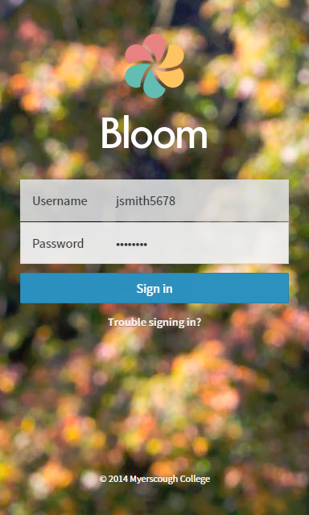

Signing In
==========

How to sign in
--------------

Navigate to https://bloom.myerscough.ac.uk/signin, enter your Myerscough username, enter your password, and select *Sign In*.

Your username consists of:

- The first letter of your first name.
- Your full surname.
- The last 4 digits of your student number.

For example, jsmith5678.

.. note:: Your default password is your date of birth in the format DDMMYYYY, for example, 31121984.

How to reset your password
--------------------------

To reset your password, navigate to the *Touble signing in?* link.
